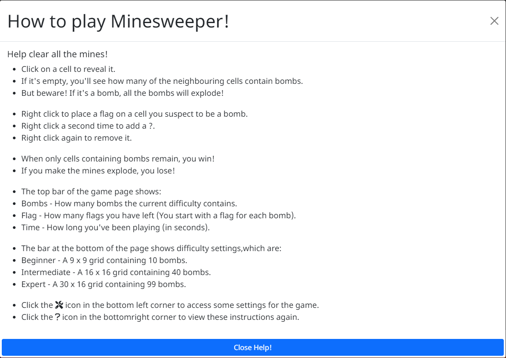
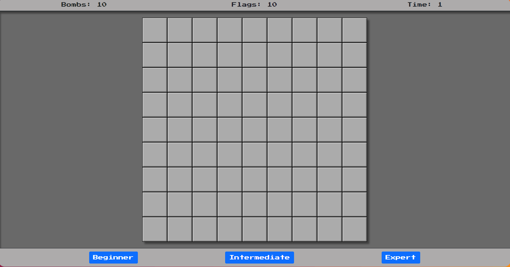

# MineSweeper -A Javascript Project

This website was created as a second portfolio project for Code Institute's Diploma in Web Application Development. The game was inspired by the classic version of Minesweeper shipped with many versions of Microsoft Windows.

The website can be [found here](https://fatheed7.github.io/minesweeper/).

## Table of Contents

-   [Objective](#objective)
-   [UX and UI](#ux-and-ui)
    -   [Site Owner Goals](#site-owner-goals)
    -   [User Stories](#user-stories)
    -   [Wireframes](#wireframes)
-   [Design](#design)
    -   [Background](#background)
    -   [Colours](#colours)
    -   [Fonts](#fonts)
    -   [Favicon](#favicon)
-   [Features](#features)
    -   [Welcome Modal](#welcome-modal)
    -   [Help Modal](#help-modal)
    -   [Settings Modal](#settings-modal)
    -   [Win Modal](#win-modal)
    -   [Lose Modal](#lose-modal)
    -   [Stats Bar](#stats-bar)
    -   [Game Area](#game-area)
    -   [Button Bar](#button-bar)
    -   [Floating Buttons](#floating-buttons)
-   [Deployment](#deployment)
-   [Testing](#testing)
    -   [Validator Testing](#validator-testing)
    -   [Manual Testing](#validator-testing)
-   [Credits](#credits)
    -   [Languages](#languages)
    -   [Frameworks, Libraries and Tools](#frameworks-libraries-and-tools)
    -   [Images](#images)

## Objective

To design an interactive version of Minesweeper with, and to demonstrate competency with, HTML, CSS & Javascript.

The was created as my second portfolio project for Code Institute's Diploma in Web Application Development.

#

## UX and UI

-   ### Site Owner Goals

    The goal of the site for the owner is to:

    1. Create a fun and interactive game of Minesweeper.
    2. Allow users to customise their experience in a number of ways, including disabling animations and remembering settings set my the customer previously.
    3. Create a simple structure on a single page, to prevent errors and encourage a user to play.

#

-   ### User Stories

    -   #### First Time Visitor Goals

        1. As a first time user, I want to immediately understand the purpose of the website.
        2. As a first time user, I want the option to be shown instructions on how the game works, but also to skip this if I'm already familiar with the game itself.
        3. As a first time user, I want to understand how to easily start a game, and for it to be obvious how to customise settings.

    -   #### Returning Visitor Goals

        1. As a returning user, I want the site to remember any settings set previously to prevent me needing to read the instructions again.
        2. As a returning user, I want the option to easily update any settings set previously.

    #

    ## Wireframes

    The wireframes for this site were created using Balasmiq, with each section and subsection noted. I endeavoured to create a single page website with the use of modals to display the rules of the game. Wireframes are available for desktop view, tablet view and, for mobile, both landscape and portrait few.
    This was added as the game is likely to be difficult to view on low resolution width devices.

    The directory containing the wireframe images can be found [here](https://github.com/Fatheed7/minesweeper/tree/main/assets/docs/wireframes).

      

      
Desktop Wireframe

    
      

       

      
Tablet Wireframe

    
      

       

      
Mobile Wireframe - Portrait

    
      

      

      
Mobile Wireframe - Landscape

    
      

#

## Design

-   ## Background

    I made use of the tool available at [SVG Backgrounds](https://www.svgbackgrounds.com/) for this site for a number of reasons.

    -   Due to the background being a scalable vector graphic, it will not lose sharpness or quality as the screen size increases and will remain responsive.
    -   Due to being an SVG, the file size of the entire background is around 5kb, greatly reducing the total size of the assets required on page load.
    -   The tool offers a large amount of customisation and is free for use, as long as attribution is given.
    -   The colour of the background chosen has high contrast against the predominantly grey colour scheme of the main game.

-   ## Colours

    -    `RGB(173, 171, 171)` - This colour was chosen for the Counters and Buttons section of the game, and for the cells within the game. The colour was chosen as it is consistent with colour of the cells in the original version of the game released by Microsoft. The colour was applied to the Counters & Buttons sections for consistency with the rest of the game, but also due to it's contrast against the background of the game area and the page in general.
    -    `RGB(105, 105, 105)` - This colour was chosen as the background of the game area as it contrasts well with the other colours chosen and draws the users eye to the brighter game elements in the center of the page. The gray tone of this colour is also in keeping with the overall theme of Minesweeper.
    -    `RGB(211, 211, 211)` - This colour was chosen as the background of the 'low screen resolution' section. This colour contrasts against the colourful background of the page well and a small gray tone was added to keep within the overall Minesweeper theme.
    -    `Green` - This colour was chosen for the floating buttons at the bottom of the page. The main reason for the use of this colour was due to the contrast against the background, and that it does not feature anywhere else on the site.

#

-   ## Fonts

    The fonts Noto Sans & Press Start 2P were chosen from the options available from Google Fonts.

    [Noto Sans](https://fonts.google.com/noto/specimen/Noto+Sans) was chosen as font for the main content in the help modal. This was chosen as it was not enjoyable to read large sections of text in the font Press Start 2P and this font is a lot more readable in that sense.

    [Press Start 2P](https://fonts.google.com/specimen/Press+Start+2P) was chosen due to retro style of the font and was primarily used for the headings of modals, the buttons and the text in the counters. As mentioned above, although the font was not enjoyable to read in large amounts, it is a lot easier in small doses.

    These fonts were chosen with user accessibility and readability in mind, with a backup on sans-serif chosen for any instances where these fonts may not be available.

-   ## Favicon

    The website [Favicon.io](https://favicon.io/) was used to generate the favicon image for the website. The Unicode emoji for collision, 💥, was chosen as the icon as it is relative to the theme of the game and is recognisable due to the popularity of emojis in general.

# Features

-   ## Welcome Modal

    

    Upon first accessing the website the user is shown the above modal, which clearly describes how to access the instructions for the game, as well as how to access settings to customise the game.

    Most important, as the site uses local storage to retain the users settings, a description has been added to warn the user:

    -   That local storage is used for this site.
    -   What settings are stored
    -   How to find more information about Web Storage
    -   How to delete any Local Storage

    #

-   ## Help Modal

    

    If the user clicks the ? button in the bottom right corner of the screen (more information about this can be found in the [Floating Buttons](#floating-buttons) section), they will be shown:

    -   Instructions on how to play the game of Minesweeper
    -   An explanation of the stats at the top of the page
    -   An explaination of the the different difficulty settings
    -   Another explaination of how to access the help and settings modals.

-   ## Settings Modal

    

    If the user clicks the button in the bottom right corner of the screen (more information about this can be found in the [Floating Buttons](#floating-buttons) section), they will be shown a number of options that will allow them to customise their experience on a number of ways.

    All of these settings use Local Storage to retain the settings. This was chosen as local storage does not have an expiration date and offers a number of advantages over using cookies.

    Upon first page load, the local storage is written and default values for the cell colours and hiding of the welcome screen are stored.

    -   ## Hide Welcome Screen On Page Load
        This option allows the user to disable to automatic loading of the Welcome Modal when they access the site.
        #
    -   ## Unrevealed Cell & Revealed Cell Colours
        Due to the light grey on dark grey colour scheme of the site, it is unlikely that users with colour blindness will have any issues, I still thought it was important to allow the user to customise the colours of the cells during the game. The currently stored colour is displayed in the colour picker when the modal is loaded.
        #
    -   ## Save Settings
        When this button is clicked, the settings are written to local storage, and immediately read again to allow the settings to be applied to the page without a reload being required.
        #
    -   ## Reset & Delete Locally Store Settings

        I have grouped these buttons together as, whilst their function differs slightly, they mainly operate in the same manner.

        Although it may seem obvious, the reset button restores the values in local storage to default values that are originally written on page load, whilst the delete button will clear the local storage entirely.

        Beyond this, both buttons operate in the following way:

        -   The user clicks the Reset/Delete button, which disappears and is replaced with a message stating 'Are you sure?' and two buttons, labelled Yes & No, to avoid any accidental deletion.
        -   Upon clicking 'Yes', the Reset/Delete buttons carry out the functions detailed above, and a confirmation message is displayed to the user confirming the requested action has been taken.
        -   Upon clicking 'No, the confirmation buttons disappear and are once again replaced by the original Reset/Delete buttons.
        -   If the user does not confirm deletion, and then closes the settings modal, the modal will return to it's default state on next load, to prevent any display issues.

        #

-   ## Win Modal

    

    Once the win condition is met for the game the above modal is displayed.

    It is intentionally minimal and allow for the user to close the modal with the cross in the top right and review their time, or click the 'Play again?' button, at which point a game of the same difficulty will be started.

    #

-   ## Lose Modal

    

    If the user clicks on a bomb, it will trigger the lose condition and the above modal is displayed.

    It is intentionally minimal and allow for the user to close the modal with the cross in the top right and review their time, or click the 'Play again?' button, at which point a game of the same difficulty will be started.

    #

-   ## Stats Bar

    

    Once the user closes the welcome modal, they will be present with the main body of the page, at the top of which is the stats bar.

    The stats bar has been given a rounded border on the top left and right corners, and a bottom border. This is to match the [Button Bar](#button-bar) in appearance, and to indicate that the elements seperate from each other which is detailed further in the [Game Area](#game-area) section.

    Initially, this will display a message asking the user to select a difficulty level (The top part of the above image).

    The buttons are displayed directly below this bar upon initial page load, making it easy to understand the next action required to start a game.

    Once the user has clicked a button, the initial message is hidden and is replaced by stats for:

    -   The number of bombs in the game
    -   The number of flags remaining
    -   A time counter, showing how long the user has been playing.

    #

    ## The Bomb Counter

    The bomb counter remaining static throughout gameplay and is only updated once a user decides to start a new game, showing the number of bombs for the selected difficulty.

    #

    ## The Flag Counter

    The flag counter is initially set to be equal to the number of bombs in the current difficulty.

    If the user right clicks on a cell a flag will be placed, and the flag counter will be reduced by 1.

    A second right click will place a ? and the flag counter will increase by 1.

    If the user clicks on a cell that currently contains a flag, it will be revealed, and the flag count will go up by 1.

    #

    ## The Timer

    The timer stars when a used clicks a difficulty button and increases in increments of one each second.

    The timer will stop when the user wins or loses the game, or will be reset if the user starts a new game.

    #

-   ## Game Area

    

    When a game is started by the user, the game area is populated with a number of DIVs equal to the game width multiplied by the game height.

    The game area is defined between the stats bar and the button bar. This was done in such a way to make it appear as if the stats and button bars have seperated to reveal the game itself, although I could not find a way to reliably animate this due to the way the grid was defined.

    An inset shadow was applied to the game area to enhance this effect and further give the appearance of the game area residing behind/within the stats and button bars.

-   ## Button Bar

    

    The button bar contains 3 buttons relating to the different difficulties for the game, and does not contain any changing elements.

    The buttons have had Bootstrap styles applied to them, and change colour slightly when hovered over by the user.

    The button bar has been given a rounded border on the bottom left and right corners, and a top border. This is to match the [Stats Bar](#stats-bar) in appearance, and to indicate that the elements seperate from each other which is detailed further in the [Game Area](#game-area) section.

    #

-   ## Floating Buttons

    

    The floating buttons at the bottom corners of the page use code taken from [Gururaj P Kharvi's Simple CSS Floating Button codepen](https://codepen.io/androidcss/pen/yOopGp).

    This was chosen as a minimalistic way to allow the user to access the help and settings modals, but still allow as much room as possible in the browser window for the game.

#

## Deployment

The site was created using Visual Studio Code and GitHub, and deployed to GitHub pages for testing using the below process:

    i. Navigate to the repository on GitHub.com
    ii. Select 'Settings' from the navigation bar near the top of the page.
    iii. Select 'Pages' from the sidebar on the left of the page.
    iv. Under the 'Sources' heading, select the 'Branch' dropdown menu and select the main branch.
    v. Once selected, click the 'Save' button to the right of the dropdown menu.
    vi. Deployment should be confirmed by a message on a green background - The message should have a green tick mark followed by "Your site is published at" followed by the web address.
    vii. Confirm deployment by navigating to the displayed web address.

#

## Testing

-   ## Validator Testing

    The website was tested using the tools made available by the [World Wide Web Consortium](https://www.w3.org/), and using [JShint](https://jshint.com/about/).

    The tools used from the World Wide Web Consortium were the [Markup Validation Service](https://validator.w3.org/#validate_by_uri) and the [CSS Validation Service](https://jigsaw.w3.org/css-validator/#validate_by_uri).

    JSHint was into into VSCode as an extension to allow customisation of the plugin, as well as the web based version. When initially validating the code a lot of errors are displayed in relation to the use of Javascript version 6, but these can be hidden using the 'Configure' button on JSHint as they are not relevant.

    The results of the validator testing can be seen below.

    

    
HTML Validation

    

    

    

    
CSS Validation

    

    

    

    
JShint Validation

    

    

#

-   ### JSHint Warnings & Undefined Variables

No errors are showin in JSHint, however there are 2 warnings showing and 3 undefined variables.

    - Functions declared within loops referencing an outer scoped variable may lead to confusing semantics. (clickCell, i)

This warning refers to functions that reference outer scoped variables. Although the warning states this can lead to confusing semantics, I believe this can be counted by appropriately descriptive docstrings.

    - Expected an assignment or function call and instead saw an expression.

This warning is due to an expression that does not assign the result to a variable.

I do not believe this warning is relevant as the purpose of the code is to reveal all the bombs within the game and, as such, variable assignment is required.

    - Undefined Variable $

This warning shows due to the use of JQuery and does not impact the code in any way.

    - Undefined Variables unrevealedColour & emptyColour

#

-   ## Manual Testing

    #

    -   ## Lighthouse Testing

        Lighthouse Desktop Test

        

        Lighthouse Mobile Test

        

        A test was ran using Lighthouse within Google Chrome to verify performance and accessibility standards were met for both mobile and desktop devices, and to ensure best practices were followed.

        I am satisfied with the results of the Lighthouse test. I would like to have resolved the Best Practicies score, but these was due to an issue stating:

            - Audit usage of navigator.userAgent, navigator.appVersion, and navigator.platform

        This was caused by the use of a CDN for JQuery and, as such, cannot be resolved.

        The full reports can be viewed below.

        -   [Lighthouse Report - Desktop](assets/docs/lighthouse_desktop.pdf)
        -   [Lighthouse Report - Mobile](assets/docs/lighthouse_mobile.pdf)

    #

    -   ## Wave Testing

        

        A further test was ran using the Web Accessibility Evaluation Tool (WAVE) to ensure no errors were returned and to verify that no constrast issues existed on the site. This was an important step to ensure that users with disabilities were not negatively impacted by the design of the site and that the relevant standards have been met.

        A full version of the test can be viewed [here](https://wave.webaim.org/report#/https://fatheed7.github.io/minesweeper/).

    #

## Credits

-   ## Languages

    -   [HTML5](https://en.wikipedia.org/wiki/HTML5)
    -   [CSS](https://en.wikipedia.org/wiki/CSS)
    -   [Javascript](https://en.wikipedia.org/wiki/JavaScript)
    -   [JQuery](https://en.wikipedia.org/wiki/JQuery)

-   ## Frameworks, Libraries and Tools

    -   [Am I Responsive](http://ami.responsivedesign.is/) - Used to verify responsiveness of website on different devices.
    -   [Balsamiq](https://balsamiq.com/) - Used to generate Wireframe images.
    -   [Bootstrap](https://getbootstrap.com/) - Main framework used for the site, with a focus on responsiveness.
    -   [Chrome Dev Tools](https://developer.chrome.com/docs/devtools/) - Used for overall development and tweaking, including testing responsiveness and performance.
    -   [Favicon.io](https://favicon.io) - Used to generate Favicon image.
    -   [Font Awesome](https://fontawesome.com/) - Used for icons on floating buttons.
    -   [GitHub](https://github.com/) - Used for version control and hosting.
    -   [Google Fonts](https://fonts.google.com/) - Used to import and alter fonts on the page.
    -   [JQuery](https://en.wikipedia.org/wiki/JQuery) - Used to simplify definition of DOM elements, but used minimally with a preference for vanilla Javascript.
    -   [JSHint](https://jshint.com/about/) - Linter used to flag errors, bugs and warnings.
    -   [LambdaTest](https://www.lambdatest.com/) - Used for Cross Site Browser Testing.
    -   [Parcel](https://www.npmjs.com/package/parcel) - Used to host website locally to aid testing before updates were commited to GitHub.
    -   [Prettier](https://marketplace.visualstudio.com/items?itemName=esbenp.prettier-vscode) - Used for consistent code formatting.
    -   [Slack](https://slack.com/) - Used for support and advice from the Code Insitute Community.
    -   [SVG Backgrounds](https://www.svgbackgrounds.com/) - Used to style the background for the site due to low file size and responsiveness. Licensed under [CC-BY 4.0](https://creativecommons.org/licenses/by/4.0/).
    -   [Visual Studio Code](https://code.visualstudio.com/) - Application used for development of this site.
    -   [W3C](https://www.w3.org/) - Used for HTML & CSS Validation.
    -   [WAVE](https://wave.webaim.org/) - Used for Accessibility evaluation.

-   ## Images

    The emoji graphic used for the favicon is from the open source project [Twemoji](https://twemoji.twitter.com/). The graphics are copyright 2020 Twitter, Inc and other contributors. The graphics are licensed under [CC-BY 4.0](https://creativecommons.org/licenses/by/4.0/).
